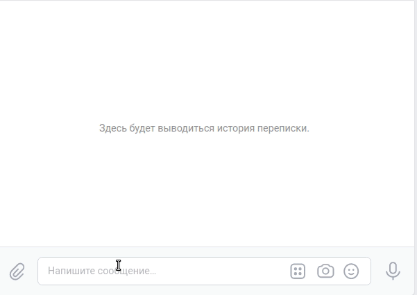

# Викторина
Чатбот для месенджера Telegram и социальной сети Вконтакте для проведения викторин.  

Пример работы для Telegram:  
  
Примера работы для Вконтакте:  
  

## Как установить
```
git clone https://github.com/Maxim80/devman_python_chatbot_quiz.git  
pip install -r requirements.txt  
```

## Как запустить
`python3 tg_bot.py` запуск бота для Telegram.  
`python3 vk_bot.py` запуск бота для Вконтакте.  

Перед запуском требуется установить следующие переменные окружени(либо добавить их в файл `.env`):
`export TELERGAM_TOKEN=<Telegram bot api токен>`  
`export VK_TOKEN=<API токен группы Вконтакте>`  
`export REDIS_HOST=<URL адрес бызы данный redis>`  
`export REDIS_PORT=<Redis порт>`  
`export REDIS_PASSW=<Пароль от redis>`  


## Цели проекта
Проект написан в учебных целях в рамках курса по python-программированию на сайте [Devman](https://dvmn.org/).
